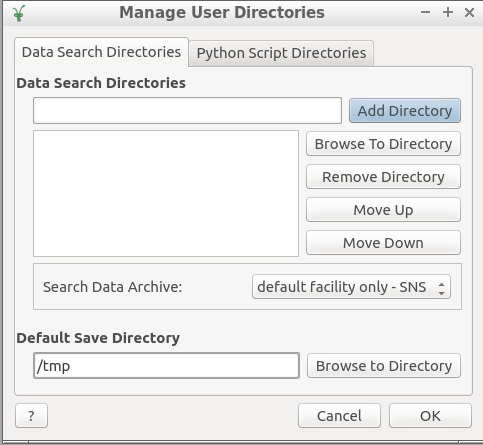

FAQ
===

Answers to questions posed by users.

The Instrument
--------------

Questions here

Monitoring Experiment Runs
--------------------------

Questions here

Data Reduction
--------------

BASISDiffraction
++++++++++++++++

**RuntimeError: [Errno 2] No such file or directory**

Full error stack trace:

.. code-block:: python

    RuntimeError: [Errno 2] No such file or directory: '/tmp/21126_ELWIN/BASISDiffraction_pDXcr3.nxs'
      at line 270 in '/home/jbq/repositories/mantidproject/mantid0/Framework/PythonInterface/plugins/algorithms/BASISDiffraction.py'
      caused by line 430 in '/home/jbq/repositories/mantidproject/mantid0/Framework/PythonInterface/plugins/algorithms/BASISDiffraction.py'
      caused by line 493 in '/home/jbq/repositories/mantidproject/mantid0/Framework/PythonInterface/plugins/algorithms/BASISDiffraction.py'
      caused by line 475 in '/usr/lib/python2.7/tempfile.py'
      caused by line 244 in '/usr/lib/python2.7/tempfile.py'
      at line 16 in 'New script'
      caused by line 1044 in '/home/jbq/repositories/mantidproject/build/master/bin/mantid/simpleapi.py'

**Solution**: During execution, BASISDiffraction saves some temporary files
within the *Default Save Directory*, in the picture below it's */tmp*.

The error indicates that the Default Save Directory is */tmp/21126_ELWIN/* but
this directory does not exists. Thus, BASISDiffraction cannot write
temporary file *BASISDiffraction_pDXcr3.nxs* in the non-existing directory.

Thus, either create the non-existing directory or change the Default Save
Directory.

BASISReduction
++++++++++++++

Questions here

Data Analysis
--------------

Questions here
