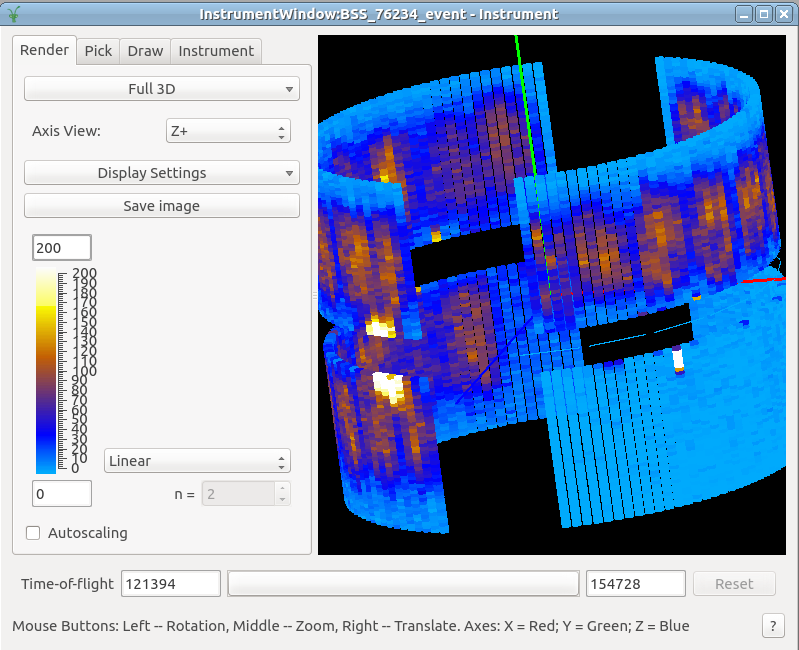
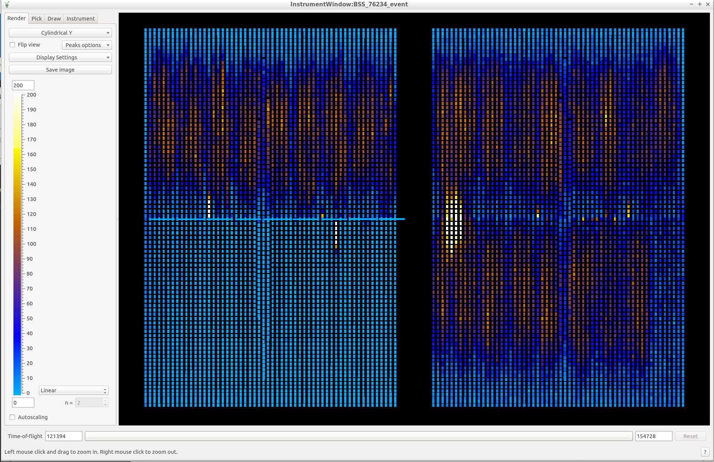

The Instrument
==============

.. contents:: :local:

Brief Description
-----------------

(From the `instrument website <https://neutrons.ornl.gov/basis>`_)
BASIS is a near-backscattering, crystal-analyzer spectrometer that provides
very fine energy resolution, as low as 3.0 to 3.5µeV at the elastic peak
(depending on sample size). This requires a long initial guide section of 84 m
from moderator to sample in order to achieve the timing resolution necessary
for obtaining the desired energy resolution. BASIS provides an excellent
dynamic range near the elastic peak of about plus and minus 100 µeV in the
standard high-intensity operation regime, which, if needed, could be extended
to plus and minus 200 µeV and beyond. The spectrometer is optimized for
quasielastic scattering but provides about 0.1% resolution in energy transfers
up to ~40 meV; the inelastic excitations need to be very sharp in order to be
measurable at high energy transfers.

Reference: `A time-of-flight backscattering spectrometer at the Spallation
Neutron Source, BASIS <http://dx.doi.org/10.1063/1.3626214>`_, Mamontov, E.,
and Herwig, K. W., Review of Scientific Instruments 82, 85109 (2011).

Selecting BASIS as Default Instrument
-------------------------------------
- Problems, questions? Check the FAQ at :ref:`FAQ/index:Selecting BASIS as Default Instrument`

(If new to Mantid, it is strongly recommended to go through the
`Basic Mantid Course <http://www.mantidproject.org/Mantid_Basic_Course>`_)

Setting BASIS as default instrument allows loading data files by passing just
the run number to the
`Load <http://docs.mantidproject.org/nightly/algorithms/Load-v1.html>`_
algorithm. There are a number of ways to set BASIS as the default instrument:

- When opening MantidPlot the `first time <http://www.mantidproject.org/MBC_Getting_set_up#Default_Instrument_and_Directories>`_.
- From the `preferences dialog <https://www.mantidproject.org/MantidPlot:_Preferences_Dialog_Mantid>`_ in MantidPlot. Dialog is accessible through the Main Menu: View :math:`\rightarrow` Preferences.
- From the `python API <https://www.mantidproject.org/Accessing_Settings_From_Python>`_ in a python script.

Visualization
-------------
- Problems, questions? Check the FAQ at :ref:`FAQ/index:Visualization`

MantidPlot allows overlay of neutron data onto a representation of the
instrument detector tubes.

Familiarize yourself with this
`Instrument View <http://www.mantidproject.org/MBC_Connecting_Data_To_Instrument>`_
and the functionality of interest:

- Creating mask files
- Aggregating intensity for arbitrary sets of detectors
- Inspection of Bragg peaks

Note: The projection *Full 3D* requires the OpenGl library which
may not be available when *remotely logged* to bac.sns.gov,
bac2.sns.gov, or analysis.sns.gov. When it's the case, use the
projection *Cylindrical-Y*.

