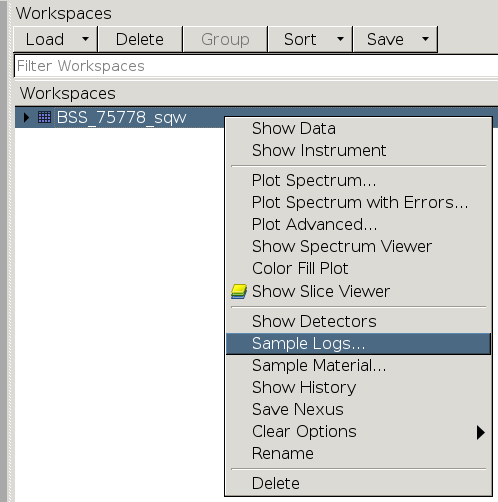
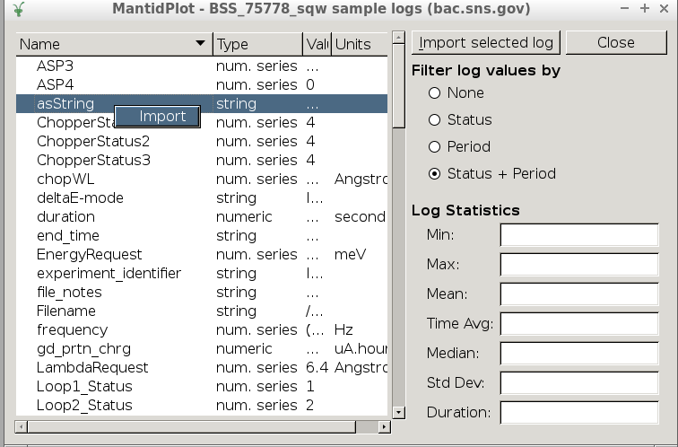
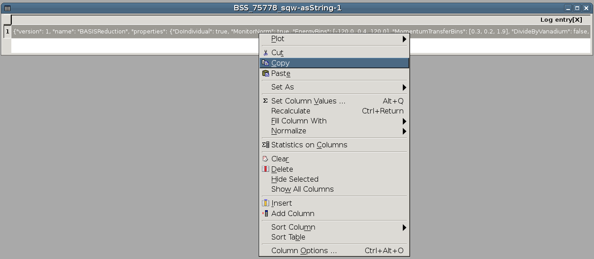

Data Reduction
==============

.. contents:: :local:

Roughly speaking, reduction is the process that yields a (static or
dynamic) scattering structure factor from a set of *neutron events*.

In BASIS, a neutron event is described by the time stamp upon emission of
the neutron from the moderator, the time-stamp upon arrival to the detector,
the kinetic energy of the neutron when hitting the detector, and the location
of the detector. With these quantities it is possible to compute the
momentum and energy transfer of the neutron when interacting with the sample.

A set of useful
`primer lectures <https://neutrons.ornl.gov/sites/default/files/intro_to_neutron_scattering.pdf>`_
to neutron scattering.

Just two algorithms are needed to reduced elastic and quasielastic neutron
events.

BASISDiffraction
++++++++++++++++
- Problems, questions? Check the FAQ at :ref:`FAQ/index:BASISDiffraction`

Elastic detector tubes are arrayed along the equatorial line of the walls.

.. image:: ../images/reduction/diff_tubes.png
   :scale: 40 %

.. image:: ../images/reduction/diff_tubes_2.png
   :scale: 15 %

Algorithm
`BASISDiffraction <http://docs.mantidproject.org/nightly/algorithms/BASISDiffraction-v1.html>`_
creates a diffraction pattern from a set of runs implementing a rotational
scan of the sample around the vertical axis. Please go to the link to read
how to run this algorithm, as well as for a hands-on example.

To have a feeling of the algorithm, copy the example in the documentation and
run it in the python window of MantidPlot. For the real deal (your sample),
you will need the vanadium run numbers and the background run number of
relevance to your sample. Ask your instrument scientist for this information.

.. code-block:: python

    from mantid.simpleapi import BASISDiffraction
    BASISDiffraction(RunNumbers='74799-74869',  # Here substitute with your runs
                    OutputWorkspace='peaky',
                    VanadiumRuns='64642-64643', # Ask instrument scientist for Vanadium runs
                    BackgroundRun='75527',  # Ask instrument scientist for the background run
                    SampleOrientation=True,
                    PsiAngleLog='SE50Rot',
                    PsiOffset=-27.0,
                    LatticeSizes=[10.71, 10.71, 10.71],
                    LatticeAngles=[90.0, 90.0, 90.0],
                    VectorU=[1, 1, 0],
                    VectorV=[0, 0, 1],
                    Uproj=[1, 1, 0],
                    Vproj=[0, 0, 1],
                    Wproj=[1, -1, 0],
                    Nbins=400)

BASISReduction
++++++++++++++
- Problems, questions? Check the FAQ at :ref:`FAQ/index:BASISReduction`

Inelastic detector tubes are located above and below the elastic detector
tubes, and are arranged into four banks of detectors. Each bank contains XXX
tubes and each tube contains XXX detectors.

/picture here denoting 111 and 311 detectors/

Three banks contain Silicon-111 detectos and only one contains Silicon-311
detectors.

Reduction Options Stored in the Logs
------------------------------------

The reduced workspaces and nexus files (both the structure factor and the dynamic
susceptibility) contain now
`log entry <http://www.mantidproject.org/Accessing_Run_Information>`_
*asString* listing the options you passed to the reduction algorithm.
This is helpful if you forgot the options you used when you reduced the data.

*Via* the python interpreter:

.. code-block:: python

    w = mtd['BSS_75778_sqw']
    r=w.getRun()
    p=r.getProperty('asString')
    print(p.value)
    '{"version": 1,
      "name": "BASISReduction",
      "properties": {"DoIndividual": true,
                     "MonitorNorm": true,
                     "EnergyBins": [-120.0, 0.4, 120.0],
                     "MomentumTransferBins": [0.3, 0.2, 1.9],
                     "DivideByVanadium": false,
                     "MaskFile": "/SNS/BSS/shared/autoreduce/new_masks_08_12_2015/BASIS_Mask_default_111.xml",
                     "ReflectionType": "silicon111",
                     "RunNumbers": "75778",
                     "NormalizeToFirst": false}
     }'

*Via* Mantidplot:

Right-click on the reduced output workspace and open the logs,

Left-click on log entry *asString* to import its contents,

​Now left-click and copy the contents from the pop-up widget to the clipboard,

​and this is what you get after you paste it in some text editor,

    {"version": 1,
     "name": "BASISReduction",
    "properties": {"DoIndividual": true,
                   "MonitorNorm": true,
                   "EnergyBins": [-120.0, 0.4, 120.0],
                   "MomentumTransferBins": [0.3, 0.2, 1.9],
                   "DivideByVanadium": false,
                   "MaskFile": "/SNS/BSS/shared/autoreduce/new_masks_08_12_2015/BASIS_Mask_default_111.xml",
                   "ReflectionType": "silicon111",
                   "RunNumbers": "75778",
                   "NormalizeToFirst": false}}

Creating a Custom Mask File
+++++++++++++++++++++++++++
- Problems, questions? Check the FAQ at :ref:`FAQ/index:Creating a Custom Mask File`

