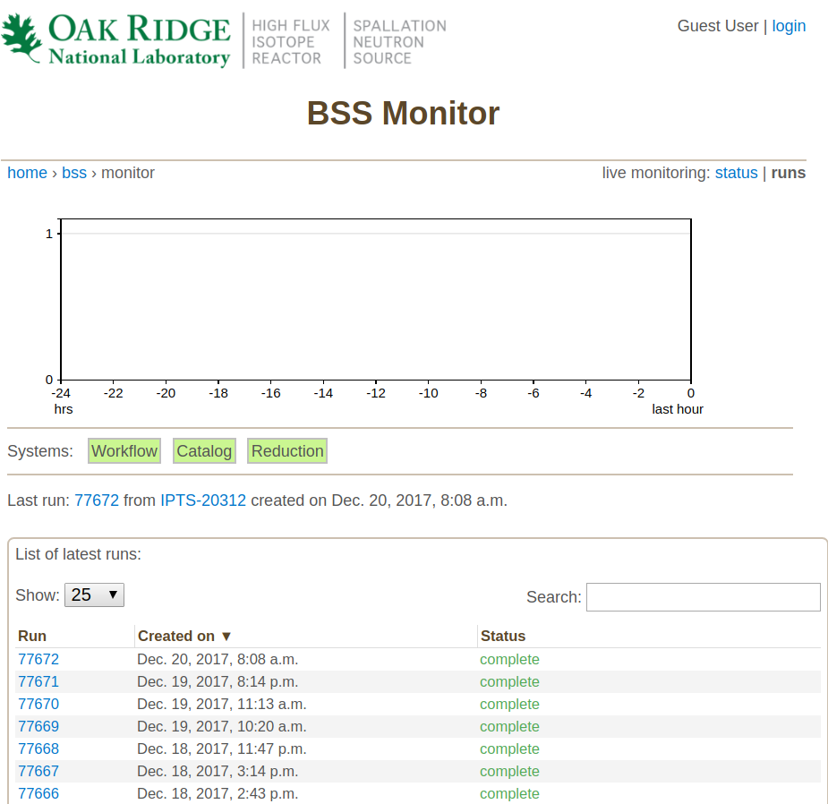
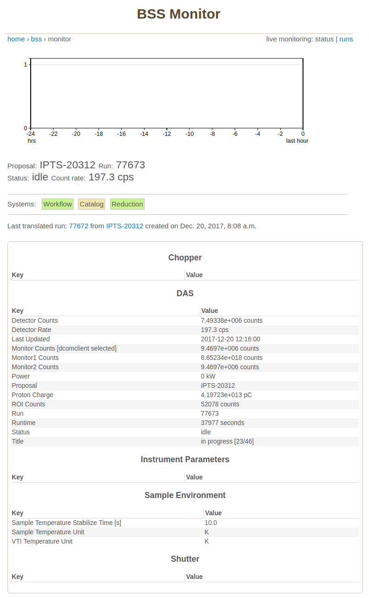
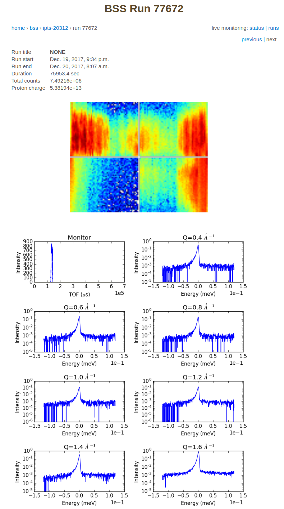
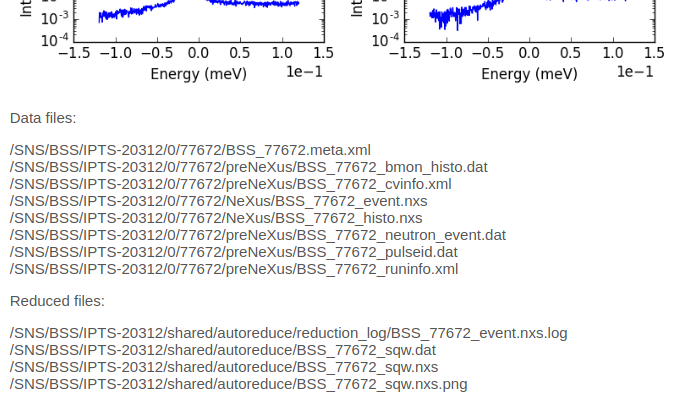

Running an Experiment
=====================

Monitoring Runs
---------------

The `monitor website <https://monitor.sns.gov/dasmon/bss/runs/>`_
for BASIS lists the list runs along with their status.

To monitor the current run, click in the *live monitoring: status* link to
be presented with information on the data acquisition and sample environment.

As a user, you have access to runs related to your IPTS proposal.
Login first (see upper right corner in the image) and then click in one
of your completed runs for summary information.
The upper portion of the run page shows the intensity at the four
detector banks and :math:`S(Q,E)` spectra reduced with typical parameters.

The lower portion of the run page shows the location of several files, among
them the *events* file that can be reduced (BSS_77672_event.nxs) and reduced
files containing the spectra in Nexus (BSS_77672_sqw.nxs)
and DAVE (BSS_77672_sqw.dat) formats.

Quick Inspection of Successful Runs
-----------------------------------

Mantid Instrument View
----------------------

