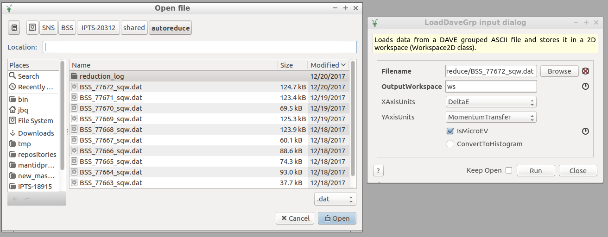
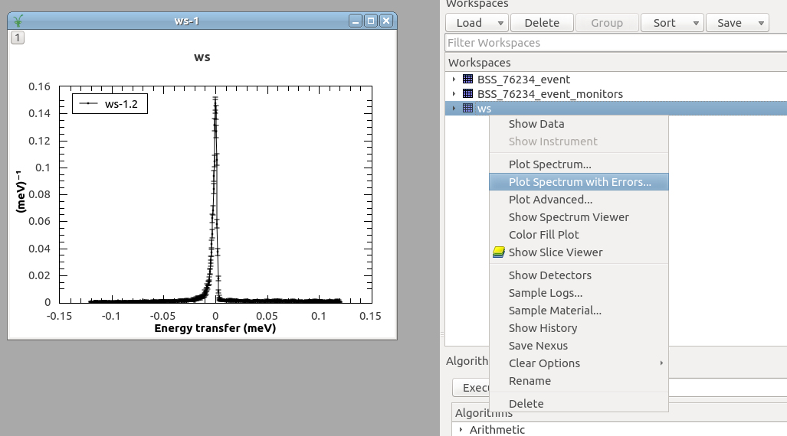

Monitoring Experiment Runs
==========================

.. contents:: :local:

Monitoring Runs
---------------
- Problems, questions? Check the FAQ at :ref:`FAQ/index:Monitoring Runs`

The `monitor website <https://monitor.sns.gov/dasmon/bss/runs/>`_
for BASIS lists the list runs along with their status.

.. image:: ../images/runs/monitor_BSS.png
   :scale: 50 %

To monitor the current run, click in the *live monitoring: status* link to
be presented with information on the data acquisition and sample environment.

.. image:: ../images/runs/monitor_BSS_current.png
   :scale: 50 %

As a user, you have access to runs related to your IPTS proposal.
Login first (see upper right corner in the image) and then click in one
of your completed runs for summary information.
The upper portion of the run page shows the intensity at the four
detector banks and :math:`S(Q,E)` spectra reduced with typical parameters.

.. image:: ../images/runs/monitor_BSS_77672.png
   :scale: 50 %

The lower portion of the run page shows the location of several files, among
them the *events* file that can be reduced (BSS_77672_event.nxs) and the
autoreduced files containing the spectra in Nexus (BSS_77672_sqw.nxs)
and DAVE (BSS_77672_sqw.dat) formats.

.. image:: ../images/runs/monitor_BSS_77672_2.png
   :scale: 50 %

Quick Inspection of Successful Runs
-----------------------------------
- Problems, questions? Check the FAQ at :ref:`FAQ/index:Quick Inspection of Successful Runs`

Auto-reduced spectra for completed runs can be checked at the
`monitor website <https://monitor.sns.gov/dasmon/bss/runs/>`_ but also
can be loaded in Mantid for inspection. For instance, the location of the
raw data for run 77672 of proposal IPTS-20312 would be

*/SNS/BSS/IPTS-20312/0/77672/NeXus/BSS_77672_event.nxs*.

This file can be
used to reduce the data with custom options using Mantid algorithms
`BASISDiffraction <http://docs.mantidproject.org/nightly/algorithms/BASISDiffraction-v1.html>`_
and
`BASISReduction <http://docs.mantidproject.org/nightly/algorithms/BASISReduction-v1.html>`_
for quasielastic and inelastic runs, respectively. Additionally, the file can
be `loaded into Mantid <http://www.mantidproject.org/MBC_Loading_Data>`_
and its neutron counts
`overlay onto the instrument <http://www.mantidproject.org/MBC_Displaying_and_Navigating_Instrument>`_.

A set of predefined reducing options are applied
to each run to derive *autoreduced*  quasielastic spectra. In our example,
files *BSS_77672_sqw.nxs* (default format for MANTID) and
*BSS_77672_sqw.dat* (default format for DAVE) are bot located in

*/SNS/BSS/IPTS-20312/shared/autoreduce/*.

File *BSS_77672_sqw.nxs* in Nexus format can be loaded into MANTID with either
the `Load <http://docs.mantidproject.org/nightly/algorithms/Load-v1.html>`_
or the `LoadNexus <http://docs.mantidproject.org/nightly/algorithms/LoadNexus-v1.html>`_
algorithms. File *BSS_77672_sqw.dat* in DAVE format can also loaded into MANTID
with the `Load <http://docs.mantidproject.org/nightly/algorithms/Load-v1.html>`_
or `LoadDaveGrp <http://docs.mantidproject.org/nightly/algorithms/LoadDaveGrp-v1.html>`_
algorithms.

When loading a DAVE file, don't forget to select the *.dat* filter in the
file browser widget, and also set the the *IsMicroEV* checkbox.

Once loaded into a *workspace*, you can plot the spectra

For more details on plotting, please refer to
`Displaying data <http://www.mantidproject.org/MBC_Displaying_data>`_
and
`Displaying data in multiple workspaces <http://www.mantidproject.org/MBC_Displaying_data_in_multiple_workspaces>`_
